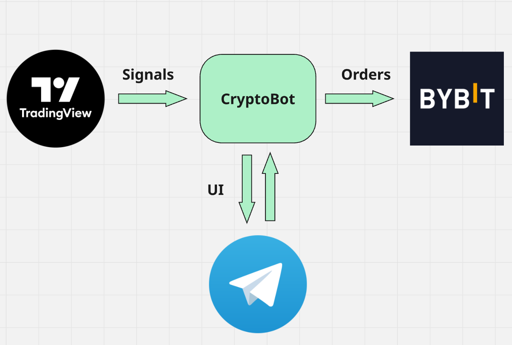
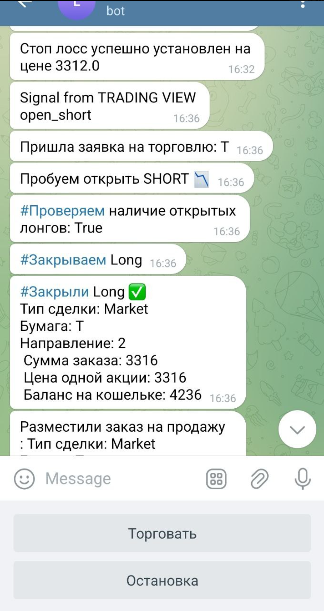

# CRYPTOBOT 📈🤖

**Платформа для алгоритмической торговли, которая позволяет интегрировать стратегии, написанные на PineScript в TradingView, с брокерами, такими как Bybit. Для взаимодействия с пользователем используется Telegram UI.**



## 🚀 О проекте

Данный проект предназначен для автоматизации торговли на криптовалютных биржах. Он позволяет:

- Подключать стратегии, написанные на PineScript в TradingView
- Автоматически отправлять сложные торговые сигналы на биржу Bybit или других брокеров
- Управлять и мониторить торговлю через удобный Telegram-бот

## 🔧 Функционал

- Интеграция с TradingView через webhook сигналы
- Поддержка нескольких брокеров (Bybit и др.)
- Управление ордерами и позициями через API брокера
- Уведомления и управление через Telegram UI
- Легкая настройка и расширяемость стратегий
- Авторизация для бота на стороне Telegram
- Шифрование чувствительных данных



## 🛠 Технологии

- PineScript (TradingView) — для написания торговых стратегий
- Python — для серверной логики
- Telegram Bot API — для пользовательского интерфейса
- Bybit API — для торговли


## 📦 Установка
- Для установки проекта достаточно использовать Dockerfile, который находится в корне проекта. 
- Убедитесь, что на сервере установлены необходимые переменные среды. Вы можете передать их как аргументы сборки Docker.
``` 
BROKER_API_KEY= EXAMPLE_BROKER_API_KEY
BROKER_SECRET_KEY= EXAMPLE_BROKER_SECRET_KEY
TELEGRAM_BOT_API_TOKEN= EXAMPLE_TELEGRAM_BOT_API_TOKEN
CRYPTOBOT_API_TOKEN= EXAMPLE_CRYPTOBOT_API_TOKEN // сгенерировать самому для webhook
```
- Так же требуется настроить JSON с параметрами торговли bot/config/trading_config.json
``` 
{
  "order_volume_percent_of_capital": 99, // Объем позиции
  "target_coin_name": "SOL", // Инструмент торговли
  "asset_name": "USDT", // Валюта на кошельке
  "leverage": 1, // Торговое плечо
  "testnet": false, // Тестовый брокер
  "test_env_vars": false,
  "demo": true // Демо торговля
}
```
## 📝 Пример использования
- Интеграция с pinescript: просто настройте ваш вебхук на использования alert
```
    jsonData = '{"signal": "close_all", "token": "your_bot_token", "timestamp": "' + str.tostring(timenow + 4) + '"}'
    alert(jsonData)
```


## 📡 Документация по сигналам для торгового бота
- Эта документация описывает виды сигналов, которые можно отправлять на сервер бота через HTTP POST-запросы. Сигналы используются для управления позициями (открытие, закрытие, стоп-лосс, тейк-профит) и получения логов. Все запросы отправляются на эндпоинт your_hosting_url/position (для позиций) или другие, как указано ниже.
- Тестер сигналов Test/TestSignalRequest.py

1. Сигнал: open_long (Открыть длинную позицию)
Открывает длинную позицию (покупка актива с ожиданием роста цены).

```
{
    "signal": "open_long",
    "timestamp": "1234562",
    "token": "your_bot_token"
}
```
2. Сигнал: open_short (Открыть короткую позицию)
Открывает короткую позицию (продажа актива с ожиданием падения цены).

```
{
    "signal": "open_short",
    "timestamp": "1234561",
    "token": "your_bot_token"
}
```

3. Сигнал: stop_loss (Установить стоп-лосс)
Устанавливает уровень стоп-лосса для закрытия позиции при достижении цены.

```
{
        "signal": "stop_loss",
        "timestamp": "1234563",
        "token": "your_bot_token",
        "side": side,
        "stop_price": str(stop_price),
}
```

4. Сигнал: take_profit (Установить тейк-профит)
Устанавливает уровень тейк-профита для закрытия позиции при достижении прибыли. Может быть обычным или рыночным (с флагом market).

```
{
        "signal": "take_profit",
        "timestamp": "1234564",
        "token": "your_bot_token",
        "side": side,
        "trigger_price": str(stop_price),
        "take_profit_percentage_from_order": str(take_profit_percentage),
}
```

5. Скачивание логов: /logs (Общие логи бота)
Скачивает файл с общими логами бота.

```
{
        "token": "your_bot_token",
}
```

6. Скачивание торговых логов: /trading_logs (Логи торгов)
Скачивает файл с логами торговых операций.

```
{
        "token": "your_bot_token",
}
```

## 🤝 Контрибьюция
Буду рад вашим предложениям и улучшениям!
Пожалуйста, создавайте issue или pull request.